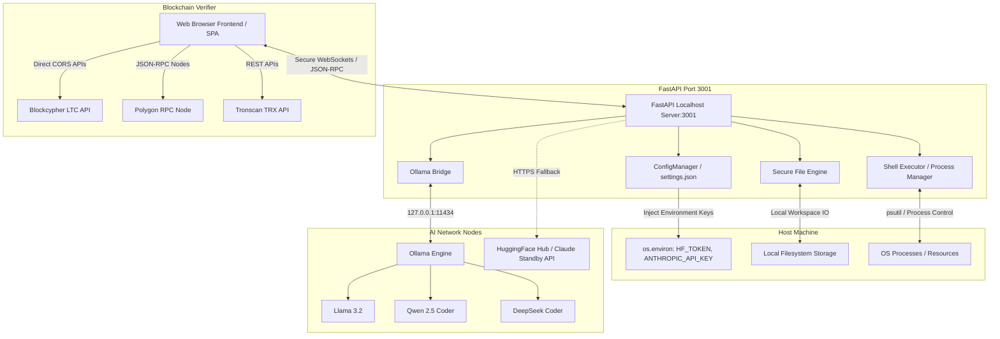

# 🌐 MULTRIIX X — THE ULTIMATE SOVEREIGN LOCAL AI DEVELOPER PLATFORM

<div align="center">

[](https://opensource.org/licenses/MIT)
[](#)
[](https://github.com/pheonix14)
[](#)
[](#)
[](#)

**MULTRIIX X** is a premium, state-of-the-art, localhost-restricted developer super-platform designed for zero-compromise privacy, complete sovereign execution, and elite AI modeling control. 

Built and maintained by **ZeroX** (aka **pheonix14** on GitHub).

---

[🚀 Quick Start](#-quick-start) • [🧠 Core Features](#-core-features) • [🔒 Hardened Security](#-hardened-security--fail-safes) • [📂 Codebase Directory](#-codebase-directory-a-to-z) • [🛠️ Architecture](#%EF%B8%8F-technical-architecture) • [📄 MIT License](#-license)

</div>

---

## 🚀 VISION & CREATOR'S NOTE
> "I want to make a real AI which can be fully modifiable and run by users instead of being controlled by massive corporations for better usage, privacy, and sovereignty. People shall have the power to own their own AI because why not? 
>
> Many people don't have the high-end resources to train their own AI, so we made **MULTRIIX X** to be the ultimate starting base. Everyone can clearly contribute here to build the world's most successful, open-source, fully-customizable local AI which can later be used everywhere as a base.
> 
> Why not? Not everyone has the money to pay for subscriptions. I am also broke, so star or donate to me if you like to support!"
>
> — **ZeroX / pheonix14**

---

## 🧠 KEY FEATURES

### 1. 🌐 Collaborative "All Mode" (AI Agent Ensemble)
* **Collective Intelligence:** A special virtual model setting `🌐 ALL AI (Ensemble)` that lets all of your local models collaborate simultaneously on a single prompt.
* **Stream Orchestrator:** Sequentially queries up to 3 of your installed local models (such as Llama, Qwen, and DeepSeek) and streams their raw thoughts side-by-side to the screen in real-time.
* **Consensus & Synthesis:** Passes the outputs to a senior coordinator model to synthesize, critique, check for accuracy, and compile the ultimate flawless consolidated response.

### 2. 📝 Integrated Code Editor (No Emojis, Pure Minimalist Design)
* **Single-Click Importer:** Every markdown code block generated in the chat can be instantly imported into your active workspace using the single-click **`Open in Editor`** action.
* **Workspace Sandbox:** Safely browse, create, read, copy, write, and execute code and scripts right from your browser-based, high-performance local workspace editor.
* **Zero Dependencies Editor:** Minimalist Nothing-style interface optimized for deepseek-coder, qwen-coder, and other elite programming models.

### 3. ⬇️ Download & Model Personality Wizard
* **Instant Installer Catalog:** Instantly download popular local models with a single click:
  * `qwen2.5-coder:1.5b` (Lightweight Coding Expert)
  * `qwen2.5-coder:7b` (SOTA Code Specialist)
  * `phi3:medium` (Microsoft Reasoning & Math)
  * `codegemma:7b` (Google Logic & Code)
  * `codellama:7b` (Meta Programming Foundation)
* **Custom Persona Creator:** Create custom AI agents with custom system prompts, temperatures, and generation constraints by building custom `Modelfiles` live in seconds.

### 4. ⚡ Live Multi-Chain Blockchain Tracker
* **Direct Mainnet Verification:** Fully decentralized, free transaction index tracking built directly into the UI dashboard.
* **Litecoin (LTC):** Queries Blockcypher indexes to track value transfers, confirmations count, and blocks state.
* **Polygon (POL/MATIC):** Initiates JSON-RPC RPC queries to calculate receipts status, gas costs, and mined confirmation offsets.
* **TRON (TRX):** Leverages public Tronscan REST APIs to track success status, transfers, and timestamps.

### 5. 📊 Real-Time Resource Monitor & Process Controller
* **Resource Gauges:** Visualized active tracking of your CPU, RAM, GPU, and Disk usages.
* **Process Termination Panel:** Lists currently running processes on your host with full filter search and single-click process termination (`Kill Process`) safety actions.

---

## 🔒 HARDENED SECURITY & FAIL-SAFES
* **Localhost Restriction:** The backend server strictly binds to `127.0.0.1` (localhost) rather than `0.0.0.0`, rendering the application completely invisible to external network snooping or adjacent Wi-Fi intruders.
* **Dynamic Port Router:** Automatically scans port bounds from range `3000` to `3099` on boot to isolate running nodes from port conflicts or hijackers.
* **Environmental Token Propagation:** Seamlessly propagates saved settings connections variables (e.g., your personal HuggingFace Tokens or Anthropic API Keys) directly to local system environment properties securely without exposure.

---

## 🛠️ TECHNICAL ARCHITECTURE

The diagram below details how data flows within the **MULTRIIX X** platform:



---

## 📂 CODEBASE DIRECTORY (A to Z)

```text
MULTRIX X/
├── LICENSE                     # Full MIT Open-Source License
├── README.md                   # Comprehensive SEO-Optimized Public README
├── README_PRIVATE.md           # Secured Owner/Developer Notes & Addresses
├── app.py                      # Primary Application Dashboard Bootstraper
├── main.py                     # Root Program Entry Point (Directs Startup Procedures)
├── config.json                 # Core Application Configurations
├── test_chat.py                # Standalone Chat Engine Diagnostics Suite
└── multriix_x/                 # Master Source Directory
    ├── CHECKLIST.md            # Completed development milestones
    ├── server.py               # Core Legacy TRON/ARES FastAPI Master Server
    ├── run.py                  # Watchdog and legacy dashboard launcher
    ├── neuraldesk/             # Modern NeuralDesk Single-Command SPA
    │   ├── app.py              # NeuralDesk Launcher
    │   ├── backend/            # FastAPI backend routers and managers
    │   │   ├── chat_session.py     # Multi-session context manager
    │   │   ├── config_manager.py   # Settings manager & config file writer
    │   │   ├── file_manager.py     # Workspace filesystem navigator & reader
    │   │   ├── model_manager.py    # Pull progress listener & models remover
    │   │   ├── ollama_bridge.py    # Unrestricted streaming client
    │   │   ├── server.py           # Core router, websockets & endpoint logic
    │   │   └── system_monitor.py   # CPU, RAM, Disk & Process mapper
    │   └── frontend/           # Responsive Vanilla HTML5/CSS3 Dashboard UI
    │       ├── index.html          # SPA view panels, layout structures & tracker scripts
    │       ├── css/
    │       │   ├── main.css            # Dark Mode, colors variables, scrollbar layout
    │       │   ├── chat.css            # Message containers, code-actions, buttons
    │       │   ├── files.css           # Workspace trees, file forms, resizers
    │       │   ├── monitor.css         # CPU gauges, processes tables
    │       │   └── config.css          # Connection inputs, slider widgets
    │       ├── js/
    │       │   ├── app.js              # View switcher, routing & lifecycle initializer
    │       │   ├── api.js              # Fetch requests client wrapper
    │       │   ├── utils.js            # Markdown parser, toasts, helpers
    │       │   ├── chat.js             # Session controls, socket handles
    │       │   ├── files.js            # Workspace trees, file loaders
    │       │   ├── config.js           # Settings inputs binds & loaders
    │       │   └── models.js           # Dropdowns populations & installation triggers
    │       └── img/
    │           ├── litecoin_qr.png     # LTC wallet receiver image
    │           ├── polygon_qr.png      # Polygon wallet receiver image
    │           └── tron_qr.png         # TRX wallet receiver image
    └── tests/                  # Secure Automated REST & WebSockets Test Suites
```

---

## 🏁 QUICK START

### 1. Prerequisites
Verify you have the following installed on your machine:
* **Python 3.10** (or higher)
* **Ollama** installed and running on your host machine.

### 2. Startup Procedures
Launch **MULTRIIX X** directly from your terminal:
```bash
python main.py
```
This single command automatically executes the following boot stages:
1. **Verification:** Confirms Python versions and checks dependency packages (`fastapi`, `uvicorn`, `psutil`, `websockets`, `aiofiles`).
2. **Ollama Check:** Validates local node communication, starts Ollama automatically if idle, and indexes available weights.
3. **Port Acquisition:** Searches for a secure open local port (falling back sequentially to range `3001`+ if standard ports are busy).
4. **Boot Host:** Initializes the FastAPI web application, automatically opens your browser, and redirects you directly to the dark mode developer console at `http://localhost:3001/`!

---

## 📄 LICENSE
Distributed under the **MIT License**. See LICENSE for full legal context.

## 🤝 CONTRIBUTIONS & SUPPORT
We welcome contributions from developers worldwide! Help us create the premier open-source local AI platform base:
* **Star** the repository on GitHub.
* Share your custom created agent personalities in PRs.
* Submit issues or improvement PRs to build premium code features.

---

<div align="center">
<b>Local AI belongs to you. Take back control with MULTRIIX X.</b>
</div>
